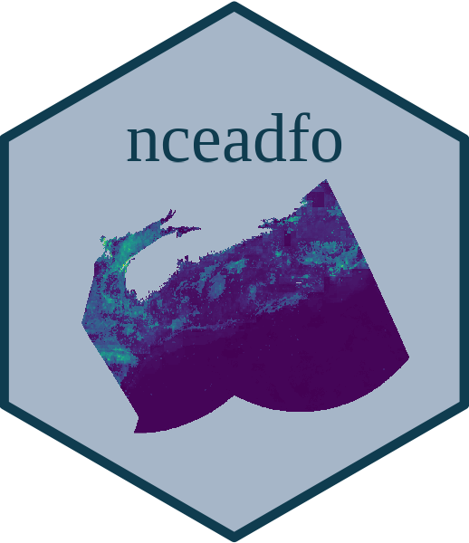

<!-- README.md is generated from README.Rmd. Please edit that file -->

# nceadfo <a href='https://github.com/Ecosystem-Assessments/nceadfo'></a>

<!-- badges: start -->

[](https://choosealicense.com/licenses/gpl-2.0/)
[](https://lifecycle.r-lib.org/articles/stages.html#preliminary)
[](#)
<!-- badges: end -->

[](https://www.tidyverse.org/lifecycle/#preliminary)


This repository contains the *research compendium* for ther project
*“Evaluating the cumulative effects of global changes on the ecological
communities of the Scotian Shelf Bioregion”*. It contains all the code
required to import, format, and integrate the data needed for the
assessment, as well as the code used to perform the analyses, figures,
and the project report.

Since data should not be stored on GitHub, no data are found on this
repository; the code structuring all steps of the assessment must
therefore be executed to replicate the assessment. It should however be
noted that certain datasets are not accessible online due to data
sharing agreements, such as the fisheries data from the Department of
Fisheries and Oceans Canada. It is therefore necessary to contact us or
the data holders to obtain these data. Metadata and bibliographic files
associated with every dataset used are however available.

### How to cite

Please cite this research compendium as follows:

> Beauchesne D (2023) Research compendium for the assessment of
> cumulative effects of global changes on the ecological communities of
> the Scotian Shelf Bioregion. Consulted on \[AAAA-MM-JJ\].
> <https://github.com/Ecosystem-Assessments/nceadfo>.

## Content

This research compendium is structured as follows:

-   [**data/**](https://github.com/Ecosystem-Assessments/nceadfo/tree/main/data):
    contains the data for the assessment.

    -   *aoi/*: spatial data on the area of interest
    -   *basemap/*: spatial data used to generate the maps of the
        assessment
    -   *cea\_modules/*: formatted data used to perform the cumulative
        effects assessment
    -   *config/*: configuration files used to access and format raw
        data and parameters used throughout the project (*e.g.* spatial
        projection, colors, bounding box, etc.)
    -   *data-abiotic/*: formatted abiotic data used for species
        distribution modelling
    -   *data-biotic/*: data on species distribution in the area of
        interest
    -   *data-integrated/*: integrated datasets
    -   *data-metaweb/*: metaweb of species interactions in the area of
        interest
    -   *data-raw/*: raw data used for the cumulative effects assessment
    -   *drivers/*: formatted data on environmental drivers in the area
        of interest
    -   *eDrivers/*: formatted data used for the
        [*eDrivers*](https://david-beauchesne.shinyapps.io/edriversapp/)
        platform
    -   *format\_modules/*: formatted data used to perform the
        cumulative effects assessment as `.RData` files for ease of
        execution
    -   *grid/*: study grid for the cumulative effects assessment
    -   *metadata/*: metadata and contacts for the raw data used for the
        cumulative effects assessment

-   [**docs/**](https://github.com/Ecosystem-Assessments/nceadfo/tree/main/docs):
    contains the html version of the report of the cumulative effects
    assessment

-   [**figures/**](https://github.com/Ecosystem-Assessments/nceadfo/tree/main/figures):
    contains all the figures generated for the cumulative effects
    assessment

-   [**man/**](https://github.com/Ecosystem-Assessments/nceadfo/tree/main/man):
    contains the documentation for all R functions that are part of the
    research compendium

-   [**output/**](https://github.com/Ecosystem-Assessments/nceadfo/tree/main/output):
    contains all the outputs from the cumulative effects assessment

    -   *cea/*: community-aggregated cumulative effects assessment for
        species-scale and network-scale assessments
    -   *cea\_difference/*: difference in cumulative effects between the
        temporal periods considered for the assessment
    -   *cea\_km2/*: assessment of cumulative effects per
        
        for all taxa considered
    -   *cea\_network/*: results for the network-scale cumulative
        effects assessment for all taxa
    -   *cea\_species/*: results for the species-scale cumulative
        effects assessment for all taxa
    -   *exposure/*: exposure of taxa to cumulative effects
    -   *footprint/*: species richness and cumulative drivers

-   [**R/**](https://github.com/Ecosystem-Assessments/nceadfo/tree/main/R):
    contains R functions developped for the assessment

    -   `fig_name.R`: scripts to generate figures
    -   `fnc_name.R`: generic functions used throughout the research
        compendium
    -   `format_modules.R`: script to prepare `.RData` files for
        assessmemnt
    -   `gather_name.R`: scripts to gather information on data used for
        the assessment
    -   `get_name.R`: scripts to access base data for the project
    -   `make_name.R` scripts to prepare the modules used for the
        assessment
    -   `out_name.R`: scripts to perform the assessment and extract
        summaries
    -   `pipeline.R`: script that executes the entirety of the
        assessment. :warning: if run, this script will take multiple
        days to run. Also take into consideration that the network-scale
        cumulative effects assessment should be run on externally on
        clusters like those offered by Compute Canada as each taxa
        should take at least 10-20 hours to execute locally depending on
        your hardware. Furthermore, not all data are available online
        due to data sharing agreements.
    -   `render_report.R`: script to render the assessment report

-   [**report/**](https://github.com/Ecosystem-Assessments/nceadfo/tree/main/report):
    contains the R Markdown version of the assessment report

-   `DESCRIPTION`: research compendium metadata (authors, date,
    dependencies, etc.)

-   `README.Rmd`: description of research compendium

## How to use

Clone this repo and execute the following commands to execute the whole
assessment.

:warning: execution time is very long, and not all raw data are
accessible online. This research compendium is thus not fully
reproducible due to hardware limitations and data sharing agreements.

``` r
R -e 'library(devtools);document()'
R CMD INSTALL .
R
source("_pipeline.R")
```

:warning: ce compendium de recherche n’est pas entièrement reproductible
dû à des restriction imposées au partage de certaines des données
utilisées pour l’évaluation.
