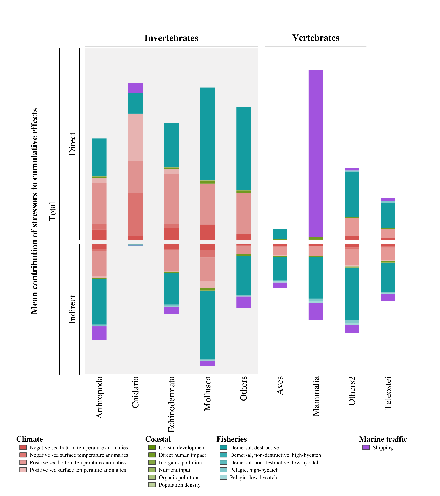
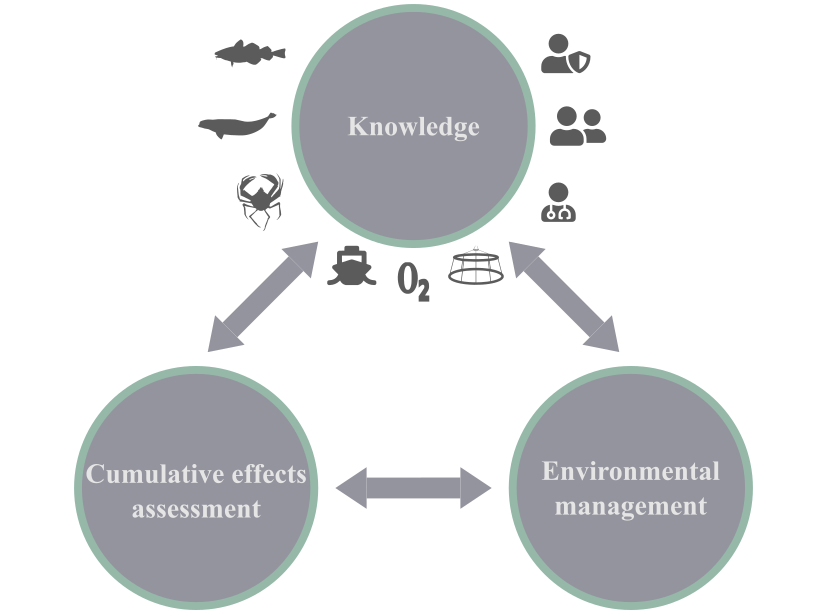
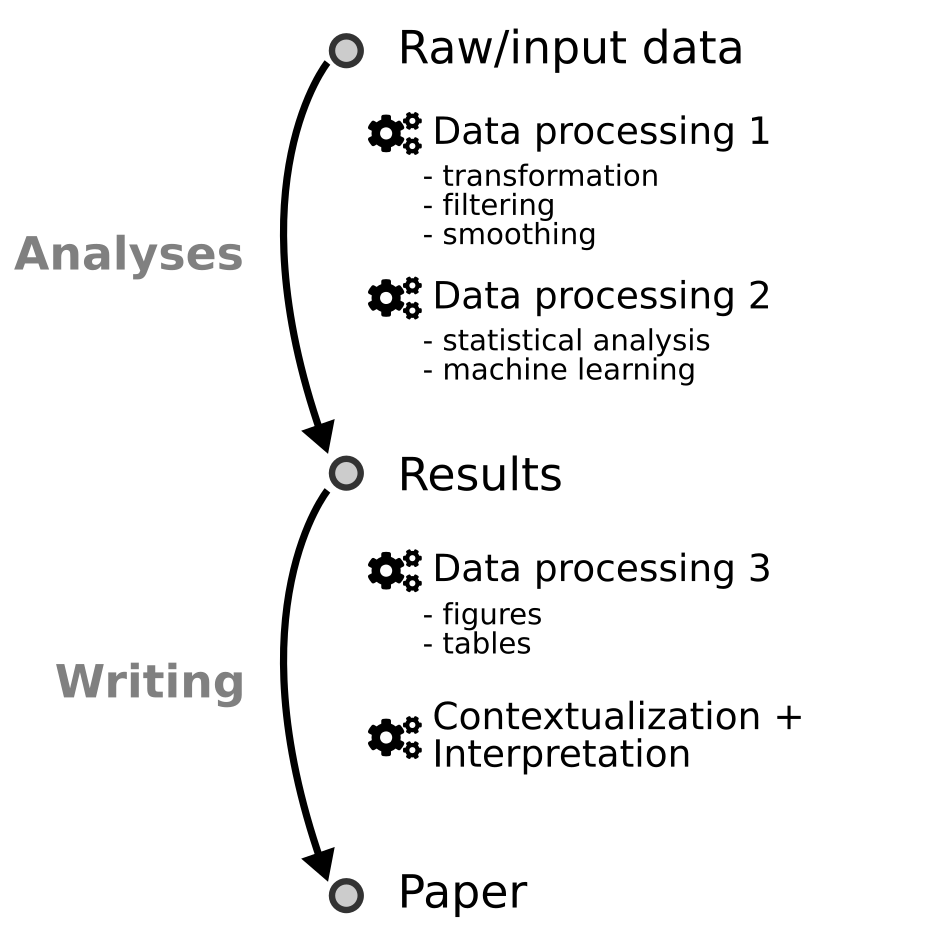
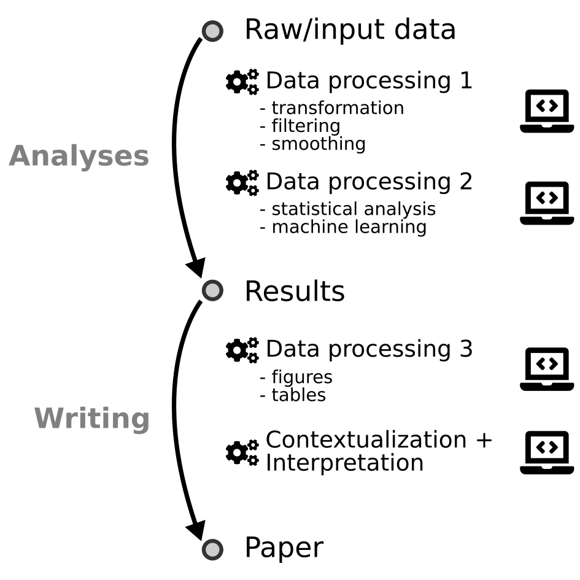

```{r setup, include=FALSE}
source("_setup.R")
# knitr::clean_cache(TRUE)
htmltools::tagList(
  xaringanExtra::use_clipboard(
    button_text = "<i class=\"fa fa-clipboard\"></i>",
    success_text = "<i class=\"fa fa-check\" style=\"color: #37abc8\"></i>",
  ),
  rmarkdown::html_dependency_font_awesome()
)
# xaringanExtra::use_scribble()

cols <- c("#777777", "#d66666", "#f0f518", "#2eb8dd", "#6a8868")

plan <- function(focus) {
  dat <- c(
    "### Context",
    # "### Scope of assessment",
    "### Assessment method",
    "### Data modules",
    "### Results",
    "### Perspectives",
    "### Data science & reproducibility"
  )
  dat[focus] <- glue::glue("#{dat[focus]}")
  for (i in 1:length(dat)) {
    cat(dat[[i]])
    cat("\n")
  }
}
```


class: title-slide, middle


# Cumulative effects assessment of global changes on ecological communities of the Scotian Shelf Bioregion

<center></img></center>

<center><i>David Beauchesne, Cindy Grant & Philippe Archambault</i></center>

<span class="br2"></span>

<center>
<a href="https://www.ulaval.ca/"></img></a>
&nbsp;&nbsp;&nbsp;&nbsp;&nbsp;&nbsp;&nbsp;&nbsp;&nbsp;&nbsp;
</img>
<!-- &nbsp;&nbsp;&nbsp;&nbsp;&nbsp;
</img> -->
</center>

<span class="br2"></span>

#### Webinar

#### 2023-03-27


---
class: inverse, center, middle

# Research team

<html><div style='float:left'></div><hr color='#ffdd55' style="margin-top:-30px" size=1px width=720px></html>


---
# Research team

<br/>

<center>
<div class="divTable team">
  <div class="divTableBody">
    <div class="divTableRow">
      <div class="divTableCell">
        <a href="mailto:david.beauchesne@hotmail.com"></a>
      </div>
      <div class="divTableCell">
        <a href="mailto:cindy.grant@bio.ulaval.ca"></a>
      </div>
      <div class="divTableCell">
        <a href="mailto:philippe.archambault@bio.ulaval.ca"></a>
      </div>
    </div>
    <div class="divTableRow">
      <div class="divTableCell"><b><a href="mailto:david.beauchesne@hotmail.com">David Beauchesne</b></a></div>
      <div class="divTableCell"><b><a href="mailto:cindy.grant@bio.ulaval.ca">Cindy Grant</b></a></div>
      <div class="divTableCell"><b><a href="mailto:philippe.archambault@bio.ulaval.ca">Philippe Archambault</b></a></div>
    </div>
    <div class="divTableRow">
      <div class="divTableCell"><a href="mailto:david.beauchesne@hotmail.com"><p style="font-size: small">david.beauchesne@hotmail.com</p></a></div>
      <div class="divTableCell"><a href="mailto:cindy.grant@bio.ulaval.ca"><p style="font-size: small">cindy.grant@bio.ulaval.ca</p></a></div>
      <div class="divTableCell"><a href="mailto:philippe.archambault@bio.ulaval.ca"><p style="font-size: small">philippe.archambault@bio.ulaval.ca</p></a></div>
    </div>
  </div>
</div>
</center>

---
class: inverse, center, middle

# Cumulative effects - Scotian Shelf

<html><div style='float:left'></div><hr color='#ffdd55' style="margin-top:-30px" size=1px width=720px></html>

```{r, echo = FALSE, results = 'asis'}
plan(1)
```

---
# Context 

<center></img></center>

.references[
  Duarte et al. 2014; Boonstra et al. 2015; FAO 2017; IPCC 2019
]

---
# Context

## Environmental effects 

.pull-left[
### *Commercial fisheries*

- Global collapse of commercial species
- Transition from large species to smaller species and crustaceans
- Deterioration of ecosystem services
]

.pull-right[


]


.references[
Pauly et al. 1998; Worm et al 2006; Fabry et al. 2008; Bove et al. 2019
]

---
# Context

## Environmental effects 
.pull-left[
### *Commercial fisheries*

- Global collapse of commercial species
- Transition from large species to smaller species and crustaceans
- Deterioration of ecosystem services

<br/>

### *Ocean acidification*

- Physiology and mortality of mollusks and corals
- Alteration of carbon flux and energy transfer
]

.pull-right[


<br/>


]


.references[
Pauly et al. 1998; Worm et al 2006; Fabry et al. 2008; Bove et al. 2019
]


---
# Context 

## Environmental effects

.pull-left[
### *Spatiotemporal overlap*

- Drivers rarely occur in isolation
]

.pull-right[


]

<br/>


.references[
Harborne et al. 2017
]

---
# Context 

## Environmental effects

.pull-left[
### *Spatiotemporal overlap*

- Drivers rarely occur in isolation

### *Driver interactions*

- Non-additive effects
]

.pull-right[

]

.references[
Darling et Côté 2008; Côté et al. 2016; Harborne et al. 2017; Lapointe et al. 2019
]


---
# Context 

## Environmental effects

.pull-left[
### *Spatiotemporal overlap*

- Drivers rarely occur in isolation

### *Driver interactions*

- Non-additive effects
]

.pull-right[

]

<br/>

$$Temperature \;+\; Pollution \;=\; \uparrow Bleaching$$

.references[
Darling et Côté 2008; Côté et al. 2016; Harborne et al. 2017; Lapointe et al. 2019
]

---
# Context 

## An ecosystem perspective

**Ecosystem management**: *management driven by explicit goals, executed by policies, protocols, and practices, and made adaptable by monitoring and research based on our best understanding of the ecological interactions and processes necessary to sustain ecosystem composition, structure, and function.*

--

**Cumulative effects**: *"effects that are likely to result from the project in combination with other projects or activities that have been or will be carried out."*

--

**Regional assessment**: *[A Regional Effects Assessment (REA)] is an [environmental assessment] whose primary or sole defining feature is its regional scope and its focus on understanding the interactions between human activities and the natural world.*


.references[
Loi canadienne sur l'évaluation environnementale (1992); Christensen et al. (1996); Sinclair et al. (2017)
]

---
# Context

## Cumulative effects assessment

<br>

<center></img></center>

.references[
Halpern et al. 2008; Halpern et al. 2015
]

---
# Context 

.pull-left2[
## Ecological interactions

**Indirects effects**

- Sea otters
- Sea urchins
- Kelp forests
]

.pull-right2[
<center></img></center>
]

.references[
Estes et Palmisano 1974; Paine 1980; Abrams 1992;  Estes et al. 2011
]

---
# Context 

.pull-left2[
## Ecological interactions

**Indirects effects**

- Sea otters
- Sea urchins
- Kelp forests

**Significance**

- Can be as important as direct effects
]

.pull-right2[
<center></img></center>
]

.references[
Wootton 1993, 2002; Menge 1995; Yodzis 2000
]

---
# Context

.pull-left2[
## Ecological interactions

**Indirects effects**

- Sea otters
- Sea urchins
- Kelp forests

**Significance**

- Can be as important as direct effects

**Propagation of effects**

- Network structure
- Species trophic position
]

.pull-right2[
<center></img></center>
]

.references[
Wootton 2002; Bascompte 2009; Montoya et al. 2009; O’Gorman et Emmerson 2009; O’Gorman et al. 2012
]

---
# Context

## Network-scale cumulative effects assessment

<br>

<center></img></center>

.references[
Beauchesne 2020
]

---
# Context

## General objective

*Assess the cumulative effects of global changes on ecological communities of the Scotian Shelf Bioregion*

<br>

--
## Specific objectives

- Characterize the intensity and spatial distribution of environmental drivers (*e.g.* shipping & fisheries);

--
- Characterize the spatial structure of ecological communities;

--
- Assess the vulnerability of species to environmental drivers;

--
- Assess the cumulative effects of environmental drivers on species.


---
# Context

## Spatial and temporal scope <!-- &nbsp;&nbsp; <a href="maps/sa.html" target="_blank">`r mp()`</a> -->

.pull-left2[
#### Spatial extent

- Scotian Shelf Bioregion
- West: Bay of Fundy
- East: South of Laurentian Channel

#### Study grid

- ~ $1km^2$ cells

#### Temporal limits

- 2010-2015
- 2016-2021
]

.pull-right2[
<br>
<center>
<a href="https://github.com/Ecosystem-Assessments/nceadfo/blob/main/figures/atlas/aoi/aoi.png?raw=true">
</img>
</a>
</center>
]


---
class: inverse, center, middle

# Cumulative effects - Scotian Shelf

<html><div style='float:left'></div><hr color='#ffdd55' style="margin-top:-30px" size=1px width=720px></html>

```{r, echo = FALSE, results = 'asis'}
plan(2)
```

---
# Method: species-scale CEA

<center></img></center>

.references[
Halpern et al. 2008; Halpern et al. 2015
]


---
# Method: species-scale CEA

<center></img></center>


.references[
Halpern et al. 2008; Halpern et al. 2015
]

---
# Method: species-scale CEA

<br/><br/>

<center></img></center>

<p style="font-size:90%;">
$$Effect = E_i * D_j * \mu_{i,j}$$
</p>


.references[
Halpern et al. 2008; Halpern et al. 2015
]

---
# Method: species-scale CEA

<center></img></center>

.references[
Halpern et al. 2008; Halpern et al. 2015
]

---
# Method: species-scale CEA

<center></img></center>

<!-- <p style="font-size:75%;">
$$C_E = \sum_i \sum_j E_i * D_j * \mu_{i,j}$$
</p> -->

.references[
Halpern et al. 2008; Halpern et al. 2015
]

---
# Method: network-scale CEA

<center></img></center>

.references[
Beauchesne et al. 2020
]

---
# Method: network-scale CEA

<center></img></center>

.references[
Milo et al. 2002; Stouffer et al. 2007; Stouffer et Bascompte 2010, Stouffer et al. 2012
]

---
# Method: network-scale CEA


<center></img></center>

.references[
Milo et al. 2002; Stouffer et al. 2007; Stouffer et Bascompte 2010, Stouffer et al. 2012
]

---
# Method: network-scale CEA

<center></img></center>

.references[
Milo et al. 2002; Stouffer et al. 2007; Stouffer et Bascompte 2010, Stouffer et al. 2012
]

---
# Method: network-scale CEA

<center></img></center>

.references[
Milo et al. 2002; Stouffer et al. 2007; Stouffer et Bascompte 2010, Stouffer et al. 2012
]

---
# Method: network-scale CEA

<center></img></center>

.references[
Milo et al. 2002; Stouffer et al. 2007; Stouffer et Bascompte 2010, Stouffer et al. 2012
]


---
# Method: network-scale CEA

<center></img></center>

<p style="font-size:75%;">
$$S_i = \sum_j D_j * \mu_{i,j}$$
</p>

.references[
Beauchesne et al. 2020
]

---
# Method: network-scale CEA

<center></img></center>

<p style="font-size:75%;">
$$S_{m_{i,x}} = \sum_{k=1}^3 \sum_j D_j * \mu_{k,j}$$
</p>

.references[
Beauchesne et al. 2020
]

---
# Method: network-scale CEA

<center></img></center>

<p style="font-size:75%;">
$$C_{i,m_{i,x}} = T_{i,m_{i,x}} * \sum_{k=1}^3 \sum_j D_j * \mu_{k,j}$$
</p>

.references[
Beauchesne et al. 2020
]

---
# Method: network-scale CEA

<center></img></center>

<p style="font-size:75%;">
$$C_{i,m_{i,x}} = T_{i,m_{i,x}} * \sum_{k=1}^3 \sum_j D_j * \mu_{k,j}$$
</p>

.references[
Beauchesne et al. 2020
]

---
# Method: network-scale CEA

<center></img></center>

<p style="font-size:75%;">
$$C_{N_{i,x}} = \frac{1}{|M_i|} \sum_{m _{i,x} \in M_i} T_{i,m_{i,x}} * \sum_{k=1}^3 \sum_j D_j * \mu_{k,j}$$
</p>

.references[
Beauchesne et al. 2020
]

---
# Method: network-scale CEA

<center></img></center>

<p style="font-size:75%;">
$$C_N = \sum_i \frac{1}{|M_i|} \sum_{m_{i,x} \in M_i} T_{i,m_{i,x}} * \sum_{k=1}^3 \sum_j D_j * \mu_{k,j}$$
</p>

.references[
Beauchesne et al. 2020
]

---
class: inverse, center, middle

# Cumulative effects - Scotian Shelf

<html><div style='float:left'></div><hr color='#ffdd55' style="margin-top:-30px" size=1px width=720px></html>

```{r, echo = FALSE, results = 'asis'}
plan(3)
```

---
# Data modules 

<center></img></center>

***Pale grey:*** data necessary for species-scale assessment

***Dark grey:*** data necessary for network-scale assessment

.references[
Halpern et al. 2008; Halpern et al. 2015; Beauchesne et al. 2020
]

---
# Data modules 

<center></img></center>

***Pale grey:*** data necessary for species-scale assessment

***Dark grey:*** data necessary for network-scale assessment

.references[
Halpern et al. 2008; Halpern et al. 2015; Beauchesne et al. 2020
]

---
# Modules: Environmental drivers

<center>
<div class="divPortrait">
  <div class="divPortraitBody">
  
    <!-- Row 1 : text -->
    <div class="divPortraitRow">
      <div class="divPortraitCell"></div>
      <div class="divPortraitTitle">
        <b>Climate</b> (4) &nbsp;<a href="https://ecosystem-assessments.github.io/nceadfo/report/modules.html#drclimate" target="_blank">`r bk()`</a>
      </div>
      <div class="divPortraitCell"></div>
      <div class="divPortraitTitle">
        <b>Coastal</b> (6) &nbsp;<a href="https://ecosystem-assessments.github.io/nceadfo/report/modules.html#drcoastal" target="_blank">`r bk()`</a>
      </div>
    </div>
    
    <!-- Row 2: figures -->
    <div class="divPortraitRow">
      <div class="divPortraitData">
      </div>
      <div class="divPortraitCell">
        <a href="https://github.com/Ecosystem-Assessments/nceadfo/blob/main/figures/webinar/climate.png?raw=true" target="_blank">
          </img>
        </a>
      </div>
      <div class="divPortraitData"></div>
      <div class="divPortraitCell">
        <a href="https://github.com/Ecosystem-Assessments/nceadfo/blob/main/figures/webinar/coastal.png?raw=true" target="_blank">
          </img>
        </a>
      </div>
    </div>
    
    <!-- Row 3 : text -->
    <div class="divPortraitRow">
      <div class="divPortraitCell"></div>
      <div class="divPortraitTitle">
        <b>Fisheries</b> (5) &nbsp;<a href="https://ecosystem-assessments.github.io/nceadfo/report/modules.html#drfisheries" target="_blank">`r bk()`</a>
      </div>
      <div class="divPortraitCell"></div>
      <div class="divPortraitTitle">
        <b>Marine traffic</b> (1) &nbsp;<a href="https://ecosystem-assessments.github.io/nceadfo/report/modules.html#drmarinetraffic" target="_blank">`r bk()`</a>
      </div>
    </div>
    
    <!-- Row 4: figures -->
    <div class="divPortraitRow">
      <div class="divPortraitData"></div>
      <div class="divPortraitCell">
        <a href="https://github.com/Ecosystem-Assessments/nceadfo/blob/main/figures/webinar/fisheries.png?raw=true" target="_blank">
          </img>
        </a>      
      </div>  
      <div class="divPortraitData">
      </div>
      <div class="divPortraitCell">
        <a href="https://github.com/Ecosystem-Assessments/nceadfo/blob/main/figures/webinar/marine_traffic.png?raw=true" target="_blank">
          </img>
        </a>      
      </div>
    </div>

  </div>
</div>
</center>

---
# Data modules 

<center></img></center>

***Pale grey:*** data necessary for species-scale assessment

***Dark grey:*** data necessary for network-scale assessment

.references[
Halpern et al. 2008; Halpern et al. 2015; Beauchesne et al. 2020
]

---
# Modules: Species
<!-- .font70[(77 sous-catégories)] -->

<center>
<div class="divPortrait">
  <div class="divPortraitBody">
  
    <!-- Row 1 : text -->
    <div class="divPortraitRow">
      <div class="divPortraitCell"></div>
      <div class="divPortraitTitle">
        <b>Marine species</b> (172) &nbsp;<a href="https://ecosystem-assessments.github.io/nceadfo/report/modules.html#marinesp" target="_blank">`r bk()`</a>
      </div>
      <div class="divPortraitCell"></div>
      <div class="divPortraitTitle">
        <b>Marine mammals</b> (8) &nbsp;<a href="https://ecosystem-assessments.github.io/nceadfo/report/modules.html#marinemammals" target="_blank">`r bk()`</a>
      </div>
    </div>
    
    <!-- Row 2: figures -->
    <div class="divPortraitRow">
      <div class="divPortraitData">
      </div>
      <div class="divPortraitCell">
        <a href="https://github.com/Ecosystem-Assessments/nceadfo/blob/main/figures/webinar/marine_species.png?raw=true" target="_blank">
          </img>
        </a>
      </div>
      <div class="divPortraitData"></div>
      <div class="divPortraitCell">
        <a href="https://github.com/Ecosystem-Assessments/nceadfo/blob/main/figures/webinar/marine_mammals.png?raw=true" target="_blank">
          </img>
        </a>
      </div>
    </div>
  </div>
</div>
</center>

<center>
<div class="divPortrait">
  <div class="divPortraitBody">
  
    <!-- Row 1 : text -->
    <div class="divPortraitRow">
      <div class="divPortraitCell"></div>
      <div class="divPortraitTitle">
        <b>Seabirds</b> (25) &nbsp;<a href="https://ecosystem-assessments.github.io/nceadfo/report/modules.html#seabirds" target="_blank">`r bk()`</a>
      </div>
    </div>
    
    <!-- Row 2: figures -->
    <div class="divPortraitRow">
      <div class="divPortraitData">
      </div>
      <div class="divPortraitCell">
        <a href="https://github.com/Ecosystem-Assessments/nceadfo/blob/main/figures/webinar/sea_birds.png?raw=true" target="_blank">
          </img>
        </a>
      </div>
    </div>
  </div>
</div>
</center>

---
# Data modules 

<center></img></center>

***Pale grey:*** data necessary for species-scale assessment

***Dark grey:*** data necessary for network-scale assessment

.references[
Halpern et al. 2008; Halpern et al. 2015; Beauchesne et al. 2020
]

---
# Modules: Species-specific sensitivity  

.pull-left[
## Traits

- Body composition
- Environment
- Feeding mode
- Mobility
- Phylum
- Size
]

.pull-right[
]

---
# Modules: Species-specific sensitivity  

.pull-left[
## Traits

- Body composition
- Environment
- Feeding mode
- Mobility
- Phylum
- Size

## Driver - Traits

- 0 = insensitive
- 1 = maximum sensitivity
]

.pull-right[
]

---
# Modules: Species-specific sensitivity  

.pull-left[
## Traits

- Body composition
- Environment
- Feeding mode
- Mobility
- Phylum
- Size

## Driver - Traits

- 0 = insensitive
- 1 = maximum sensitivity

## Driver - Species

- Product of relative sensitivity of all traits
- Relative sensitivity [0,1]
]

.pull-right[
]

---
# Modules: Species-specific sensitivity  

.pull-left[
## Traits

- Body composition
- Environment
- Feeding mode
- Mobility
- Phylum
- Size

## Driver - Traits

- 0 = insensitive
- 1 = maximum sensitivity

## Driver - Species

- Product of relative sensitivity of all traits
- Relative sensitivity [0,1]]

.pull-right[
## Shipping - Minke whale

### Traits considered
- Environment
- Size

### Whale trait value (sensitivity)
- Pelagic (1)
- $>$ 3 meters (1)

### Sensitivity

$$ 1 * 1 = 1$$
]

---
# Modules: Species-specific sensitivity  

<br/> 

<center></img></center>

---
# Data modules 

<center></img></center>

***Pale grey:*** data necessary for species-scale assessment

***Dark grey:*** data necessary for network-scale assessment

.references[
Halpern et al. 2008; Halpern et al. 2015; Beauchesne et al. 2020
]

---
# Modules: Metaweb

.pull-left[
**Predict interations:** Unsupervised machine learning

**Assumption:** Similar species consume and are consumed by similar species

**Similarity criteria:** taxonomy & diet

**Interaction catalog:**

- 183 625 pairwise interactions 
- 14 870 taxa
]

.pull-right3[
<br/>
<center></img></center>
]

.references[
Brose et al. 2005; Barnes et al. 2008; Kortsch et al. 2015; University of Canberra
2016; Poelen et al., 2014, 2019; [GloBI](https://www.globalbioticinteractions.org/);
Beauchesne et al. 2017
]


---
# Data modules 

<center></img></center>

***Pale grey:*** data necessary for species-scale assessment

***Dark grey:*** data necessary for network-scale assessment

.references[
Halpern et al. 2008; Halpern et al. 2015; Beauchesne et al. 2020
]

---
# Modules: Trophic sensitivity

## Simulations

<span class="br2"></span>

<center></img></center>

.references[
Beauchesne et al. 2021
]

---
# Modules: Trophic sensitivity

## Simulations

<span class="br2"></span>

<center></img></center>

**Lotka-Volterra models:** $\frac{dX_i}{dt} = X_i(r_i - \alpha_{ii} X_i + \sum_j e_{ij} \alpha_{ij} X_j)$

.references[
Beauchesne et al. 2021
]

---
# Modules: Trophic sensitivity

## Simulations

<span class="br2"></span>

<center></img></center>

**Lotka-Volterra models:** $\frac{dX_i}{dt} = X_i(r_i - \alpha_{ii} X_i + \sum_j e_{ij} \alpha_{ij} X_j)$

**Simulated stressors:** 1% variation of equilibrium parameters

.references[
Beauchesne et al. 2021
]

---
# Modules: Trophic sensitivity

## Simulations

<span class="br2"></span>

<center></img></center>

**Lotka-Volterra models:** $\frac{dX_i}{dt} = X_i(r_i - \alpha_{ii} X_i + \sum_j e_{ij} \alpha_{ij} X_j)$

**Simulated stressors:** 1% variation of equilibrium parameters

**All possible combinations simulated for each motif**

.references[
Beauchesne et al. 2021
]

---
# Modules: Trophic sensitivity

## Simulations

<span class="br2"></span>

<center></img></center>

**Lotka-Volterra models:** $\frac{dX_i}{dt} = X_i(r_i - \alpha_{ii} X_i + \sum_j e_{ij} \alpha_{ij} X_j)$

**Simulated stressors:** 1% variation of equilibrium parameters

**All possible combinations simulated for each motif**

**Mesured response:** Initial and post-stressor abundances as proxy of trophic sensitivity

.references[
Beauchesne et al. 2021
]

---
class: inverse, center, middle

# Cumulative effects - Scotian Shelf

<html><div style='float:left'></div><hr color='#ffdd55' style="margin-top:-30px" size=1px width=720px></html>

```{r, echo = FALSE, results = 'asis'}
plan(4)
```

---
# Results

## Species richness

.pull-left2[
- Medium-high:
  - Continental shelf
  - Eastern & western Nova-Scotia 
  - Western Bay of Fundy
  - Transition shelf to slope

- Lower:
  - Coastal areas $^*$
  - Continental slope $^*$
]
.pull-right2[
<br>
[<center></img></center>](https://github.com/Ecosystem-Assessments/nceadfo/blob/main/figures/webinar/species.png?raw=true)
]

.references[
$^*$Caused by surveys sampling continental shelf more extensively and not extending to coastal areas
]

---
# Results

## Cumulative drivers

<br2>

.pull-left2[
- Medium-high: 
  - Continental shelf
  - Eastern Bay of Fundy
  - Coastal areas & towns 

- Low: 
  - Continental slope $^*$
]
.pull-right2[
<br>
[<center></img></center>](https://github.com/Ecosystem-Assessments/nceadfo/blob/main/figures/webinar/drivers.png?raw=true)
]

.references[
$^*$Only 3 drivers extending to the continental slope
]

---
# Results

## Cumulative effects

.pull-left2[
- High: 
  - Bay of Fundy
  - Southwest Nova-Scotia
  - Northeast Sable Island
  - South Cape Breton

- Medium: 
  - Center shelf 
  - Northeastern corner

- Low:
  - Continental slope
]
.pull-right2[
<br>
[<center></img></center>](https://github.com/Ecosystem-Assessments/nceadfo/blob/main/figures/webinar/ncea_2016_2021full.png?raw=true)
]

---
# Results

## Pathways of effect

.pull-left2[
- Overview of assessment 

- Most impactful drivers
  - Shipping, fisheries, climate

- Invertebrates more at risk
]
.pull-right2[
[<center></img></center>](https://github.com/Ecosystem-Assessments/nceadfo/blob/main/figures/webinar/metanetwork-Total_2016_2021.png?raw=true)
]

---
# Results

## Pathways of effect

.pull-left2[
- Overview of assessment 

- Most impactful drivers
  - Shipping, fisheries, climate

- Invertebrates more at risk

- Direct pathways (n = 873)
]

.pull-right2[
[<center></img></center>](https://github.com/Ecosystem-Assessments/nceadfo/blob/main/figures/webinar/metanetwork-Direct_2016_2021.png?raw=true)
]

---
# Results

## Pathways of effect

.pull-left2[
- Overview of assessment 

- Most impactful drivers
  - Shipping, fisheries, climate

- Invertebrates more at risk

- Direct pathways (n = 873)

- Indirect pathways (n = 2057)
]

.pull-right2[
[<center></img></center>](https://github.com/Ecosystem-Assessments/nceadfo/blob/main/figures/webinar/metanetwork-Indirect_2016_2021.png?raw=true)
]


---
# Results

## Direct & indirect effects

.pull-left2[
]

.pull-right2[
[<center></img></center>](figures/results/1-contribution_group.png)
]

---
# Results

## Direct & indirect effects

.pull-left2[
***Direct effects***

**Invertebrates**: all drivers 

- Sessile species
- More sensitive to their physico-chemical environment

**Vertebrates**: shipping and fisheries

- Mobile species 
- Ability to minimize exposure to stress
]

.pull-right2[
[<center></img></center>](figures/results/1-contribution_group.png)
]

.references[
Kroeker et al. 2010, 2013; Sydeman et al. 2015; Stier et al. 2016
]

---
# Results

## Direct & indirect effects

.pull-left2[
***Indirect effects***

**Invertebrates**: all drivers 

- Similar relative intensity
- Trophic position: resources 

**Vertebrates**: all drivers

- Greater relative intensity 
- High trophic levels 
- Sensitive to indirect effects
]

.pull-right2[
[<center></img></center>](figures/results/1-contribution_group.png)
]

.references[
Kroeker et al. 2010, 2013; Sydeman et al. 2015; Stier et al. 2016
]

---
# Results

## Direct & indirect effects

.pull-left2[
***Indirect effects***

**Invertebrates**: all drivers 

- Similar relative intensity
- Trophic position: resources 

**Vertebrates**: all drivers

- Greater relative intensity 
- High trophic levels 
- Sensitive to indirect effects
]

.pull-right2[
[<center></img></center>](https://github.com/Ecosystem-Assessments/nceadfo/blob/main/figures/atlas/biotic/balaenoptera_acutorostrata-137087.png?raw=true)
]

.references[
Kroeker et al. 2010, 2013; Sydeman et al. 2015; Stier et al. 2016
]

---

class: inverse, center, middle

# Cumulative effects - Scotian Shelf

<html><div style='float:left'></div><hr color='#ffdd55' style="margin-top:-30px" size=1px width=720px></html>

```{r, echo = FALSE, results = 'asis'}
plan(5)
```

---
# Perspectives 

## Data modules

<br>

<center></img></center>

---

class: inverse, center, middle

# Cumulative effects - Scotian Shelf

<html><div style='float:left'></div><hr color='#ffdd55' style="margin-top:-30px" size=1px width=720px></html>

```{r, echo = FALSE, results = 'asis'}
plan(6)
```

---
# Data science & reproducibility

## Knowledge management

<span class="br2"></span>

.pull-left[
- Vast knowledge required

- Typically distributed between many experts

- Time dedicated to:
  - Research relevant information
  - Developping collaborations
  - Formatting and structuring data

- **Strive to facilitate reuse and secondary uses**
]

.pull-right[
<center></img></center>
]

---
# Data science & reproducibility

## Knowledge management

<span class="br2"></span>

.pull-left[
- Important movement towards openly sharing knowledge

- Archiving and online access (ex. [Open Government](https://open.canada.ca/en))

- Advantages :
  - Reproductibility
  - Transparency
  - Efficiency
  - Optimizing investments
  - Promote knowledge
  - Collaborations
]

.pull-right[
<center></img></center>
]

---
# Data science & reproducibility

## Management - Assessment - Knowledge

<span class="br2"></span>

.pull-right2[
<center></img></center>
]


---
# Data science & reproducibility

## Management - Assessment - Knowledge

<span class="br2"></span>

.pull-left2[
- Dissociate knowledge acquisition
  - Efficiency
  - Common structure
  - Accessibility

- Collaboration, mobilisation et consultation processes are still vital

- Focus on management and assessment
]

.pull-right2[
<br/>
<center></img></center>
]

---
# Data science & reproducibility

### Example: [***eDrivers***](https://david-beauchesne.shinyapps.io/edriversapp_dev/)

<span class="br2"></span>

.pull-left2[

- Initiative to share knowledge on stressors

- Objective:

.font80[
> Create a community of experts dedicated to structuring, sharing and standardizing knowledge on environmental stressors
]
]

.pull-right2[
<center><a href="https://david-beauchesne.shinyapps.io/edriversapp_dev/"></img></a></center>
]

---
# Data science & reproducibility

.pull-left[
## The era of data supermarkets!

- Data archiving
]

.pull-right[
<center></img></center>
]

---
# Data science & reproducibility

.pull-left[
## The era of data supermarkets!

- Data archiving

## Where is Ricardo?

- Reproducible analytical pipelines
]

.pull-right[
<center></img></center>
]

---
# Data science & reproducibility

## Reproducible workflows

.pull-left[
- ***Transparency & reproducibility***
  - `r rp()` &nbsp; &nbsp; `r gh()`
- ***All code associated with:***
  - Accessing raw data 
  - Formatting data 
  - Analyses
  - Figures and tables
  - Report
  - This presentation
]

.pull-right[
<center></img></center>
]

---
# Data science & reproducibility

## Reproducible workflows

.pull-left[
- ***Transparency & reproducibility***
  - `r rp()` &nbsp; &nbsp; `r gh()`
- ***All code associated with:***
  - Accessing raw data 
  - Formatting data 
  - Analyses
  - Figures and tables
  - Report
  - This presentation
]

.pull-right[
<center></img></center>
]

---
# Data science & reproducibility

## Reproducible workflows

.pull-left[
- ***Transparency & reproducibility***
  - `r rp()` &nbsp; &nbsp; `r gh()`
- ***All code associated with:***
  - Accessing raw data 
  - Formatting data 
  - Analyses
  - Figures and tables
  - Report
  - This presentation
]

.pull-right[
<center></img></center>
]

---
# Data science & reproducibility

## Reproducible workflows

.pull-left[
- ***Transparency & reproducibility***
  - `r rp()` &nbsp; &nbsp; `r gh()`
- ***All code associated with:***
  - Accessing raw data 
  - Formatting data 
  - Analyses
  - Figures and tables
  - Report
  - This presentation
- ***Advantages***
  - Structured, reproducible and transparent process 
  - Reuse workflows across projects
  - Increased efficiency (weeks to minutes)
]

.pull-right[
<center></img></center>
]

---
# Data science & reproducibility <a href='https://github.com/Ecosystem-Assessments/nceadfo'></a>

## Research compendium: ***nceadfo***

<center><a href="https://github.com/Ecosystem-Assessments/nceadfo"></img></a></center>


---
# Data science & reproducibility <a href='https://github.com/Ecosystem-Assessments/pipedat'></a>


## ***pipedat*** `r tr()`

.pull-left[
- Formalizing and sharing analytical pipelines
- Data access and formatting 
- Creation of integrated datasets
- `r rp()` package to execute pipelines
]

.pull-right[
<center></img></center>
]

---
# Data science & reproducibility <a href='https://github.com/Ecosystem-Assessments/pipedat'></a>

## ***nceadfo*** + ***pipedat***

.font55[
| Data | Scotian Shelf | St. Lawrence | Newfoundland & Labrador |
| :----- | :---: | :---: | :---: | 
| **Biotic data** | | | |
| &nbsp;&nbsp; Marine species | `r ch()` | | |
| &nbsp;&nbsp; Marine mammals | `r ch()` | `r ch()` | `r ch()` |
| &nbsp;&nbsp; Seabirds | `r ch()` | `r ch()` | `r ch()` |
| **Abiotic data** (23) | `r ch()` | `r ch()` | `r ch()` |
| **Drivers** | | | |
| &nbsp;&nbsp; Surface-water temperature anomalies (2) | `r ch()` | `r ch()` | `r ch()` |
| &nbsp;&nbsp; Bottom-water temperature anomalies (2) | `r ch()` | | |
| &nbsp;&nbsp; Coastal development | `r ch()` | `r ch()` | `r ch()` |
| &nbsp;&nbsp; Direct human impact | `r ch()` | `r ch()` | `r ch()` |
| &nbsp;&nbsp; Inorganic pollution | `r ch()` | | |
| &nbsp;&nbsp; Organic pollution | `r ch()` | | |
| &nbsp;&nbsp; Nutrient input | `r ch()` | | |
| &nbsp;&nbsp; Population density | `r ch()` | | |
| &nbsp;&nbsp; Fisheries (5) | `r ch()` | `r ch()` | `r ch()` |
| &nbsp;&nbsp; Invasive species | `r ch()` | `r ch()` | `r ch()` |
| &nbsp;&nbsp; Shipping | `r ch()` | `r ch()` | `r ch()` |
]

---
# Data science & reproducibility <a href='https://github.com/Ecosystem-Assessments/pipedat'></a>

## ***nceadfo*** + ***pipedat***

<center></img></center>


---
class: inverse, center, middle

# Acknowledgements 

<html><div style='float:left'></div><hr color='#ffdd55' style="margin-top:-30px" size=1px width=720px></html>

## Because without your work, ours would not be possible

---
# Acknowledgements 

--
***Collaborators and organizations that exchanged and shared with our research team*** <br>


--
***Department of Fisheries and Oceans*** <br>


--
***Tana Worchester, Caroline Longtin, Catalina Gomez*** <br>


--
***Jacob Dale, Andréanne Beardsell, Vincent Bellavance*** <br>

---
# Reach out for any questions/comments!

<br/>

<center>
<div class="divTable team">
  <div class="divTableBody">
    <div class="divTableRow">
      <div class="divTableCell">
        <a href="mailto:david.beauchesne@hotmail.com"></a>
      </div>
      <div class="divTableCell">
        <a href="mailto:cindy.grant@bio.ulaval.ca"></a>
      </div>
      <div class="divTableCell">
        <a href="mailto:philippe.archambault@bio.ulaval.ca"></a>
      </div>
    </div>
    <div class="divTableRow">
      <div class="divTableCell"><b><a href="mailto:david.beauchesne@hotmail.com">David Beauchesne</b></a></div>
      <div class="divTableCell"><b><a href="mailto:cindy.grant@bio.ulaval.ca">Cindy Grant</b></a></div>
      <div class="divTableCell"><b><a href="mailto:philippe.archambault@bio.ulaval.ca">Philippe Archambault</b></a></div>
    </div>
    <div class="divTableRow">
      <div class="divTableCell"><a href="mailto:david.beauchesne@hotmail.com"><p style="font-size: small">david.beauchesne@hotmail.com</p></a></div>
      <div class="divTableCell"><a href="mailto:cindy.grant@bio.ulaval.ca"><p style="font-size: small">cindy.grant@bio.ulaval.ca</p></a></div>
      <div class="divTableCell"><a href="mailto:philippe.archambault@bio.ulaval.ca"><p style="font-size: small">philippe.archambault@bio.ulaval.ca</p></a></div>
    </div>
  </div>
</div>
</center>


---


---
class: inverse, center, middle

# Additional slides

<html><div style='float:left'></div><hr color='#ffdd55' style="margin-top:-30px" size=1px width=720px></html>

---
# Modules: Trophic sensitivity

<center></img></center>

.references[
Beauchesne et al. 2021
]

---
# Modules: Trophic sensitivity

## Omnivory dynamic (beluga-cod-capelin)

<span class="br2"></span>

<center></img></center>

.references[
Beauchesne et al. 2021
]

---
# Modules: Trophic sensitivity

## Omnivory dynamic (beluga-cod-capelin)

<span class="br2"></span>

<center></img></center>

.references[
Beauchesne et al. 2021
]

---
# Modules: Trophic sensitivity

## Omnivory dynamic (beluga-cod-capelin)

<span class="br2"></span>

<center></img></center>

.references[
Beauchesne et al. 2021
]

---
# Modules: Trophic sensitivity

## Omnivory dynamic (beluga-cod-capelin)

<span class="br2"></span>

<center></img></center>

.references[
Beauchesne et al. 2021
]

---
# Modules: Trophic sensitivity

## Omnivory dynamic (beluga-cod-capelin)

<span class="br2"></span>

<center></img></center>

**Trophic sensitivity**: proxy of sensitivity to environmental drivers

.references[
Beauchesne et al. 2021
]

---
# Modules: Trophic sensitivity

## Omnivory dynamic (beluga-cod-capelin)

<span class="br2"></span>

<center></img></center>

**Trophic sensitivity**: proxy of sensitivity to environmental drivers

.references[
Beauchesne et al. 2021
]

---
# Modules: Trophic sensitivity

## Omnivory dynamic (beluga-cod-capelin)

<span class="br2"></span>

<center></img></center>

**Trophic sensitivity**: proxy of sensitivity to environmental drivers

.references[
Beauchesne et al. 2021
]

---
# Modules: Trophic sensitivity

## Omnivory dynamic (beluga-cod-capelin)

<span class="br2"></span>

<center></img></center>

**Trophic sensitivity**: proxy of sensitivity to environmental drivers

.references[
Beauchesne et al. 2021
]

---
# Modules: Trophic sensitivity

## Omnivory dynamic (beluga-cod-capelin)

<span class="br2"></span>

<center></img></center>

**Trophic sensitivity**: proxy of sensitivity to environmental drivers

.references[
Beauchesne et al. 2021
]


---
# Results

## Change in cumulative effects

.pull-left2[
- Slight decrease in relative intensity
- General decrease for areas more at risk in 2010-2015
- Except Bay of Fundy
]
.pull-right2[
<br>
[<center></img></center>](https://github.com/Ecosystem-Assessments/nceadfo/blob/main/figures/webinar/cea_network_difference.png?raw=true)
]
