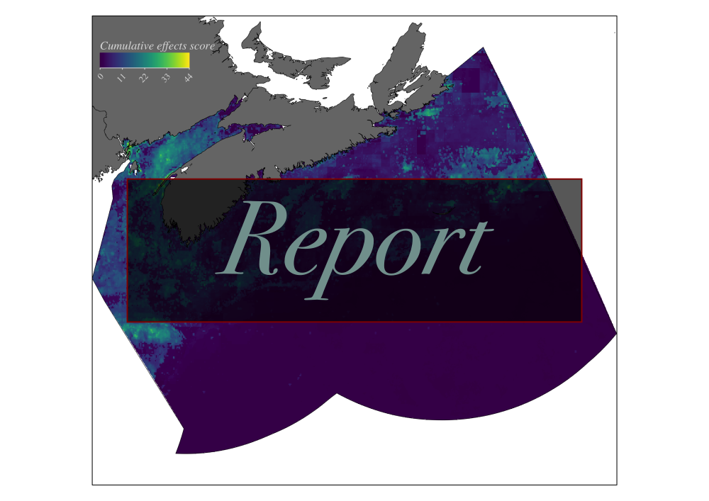
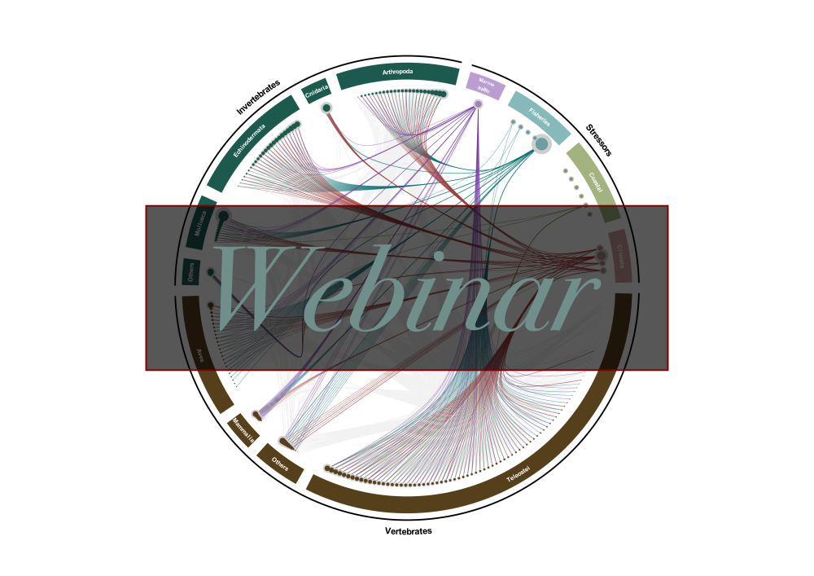
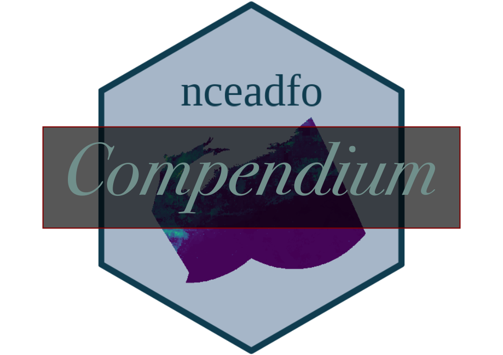

```{r setup, include=FALSE}
source('_setup.R')
# knitr::clean_cache(TRUE)
htmltools::tagList(
  xaringanExtra::use_clipboard(
    button_text = "<i class=\"fa fa-clipboard\"></i>",
    success_text = "<i class=\"fa fa-check\" style=\"color: #37abc8\"></i>",
  ),
  rmarkdown::html_dependency_font_awesome()
)
# xaringanExtra::use_scribble()

cols <- c('#777777','#d66666','#f0f518','#2eb8dd','#6a8868')
```


class: title-slide, middle


# Cumulative effects assessment of global changes on ecological communities of the Scotian Shelf Bioregion

<span class="br2"></span>

<center>
<a href ="report/index.html"></a>
<a href ="webinar/index.html"></a>
</img></center>

<center>
<a href ="https://github.com/Ecosystem-Assessments/nceadfo/"></a>
<a href ="https://david-beauchesne.shinyapps.io/edriversapp_dev/"></a>
</img></center>

<span class="br2"></span>

<center><i>David Beauchesne, Cindy Grant & Philippe Archambault</i></center>

<span class="br2"></span>

<center>
<a href="https://www.ulaval.ca/"></img></a>
&nbsp;&nbsp;&nbsp;&nbsp;&nbsp;&nbsp;&nbsp;&nbsp;&nbsp;&nbsp;
</img>
<!-- &nbsp;&nbsp;&nbsp;&nbsp;&nbsp;
</img> -->
</center>

