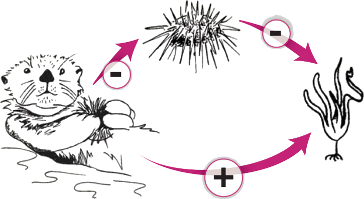

```{r setup, include=FALSE}
source('_setup.R')
# knitr::clean_cache(TRUE)
htmltools::tagList(
  xaringanExtra::use_clipboard(
    button_text = "<i class=\"fa fa-clipboard\"></i>",
    success_text = "<i class=\"fa fa-check\" style=\"color: #37abc8\"></i>",
  ),
  rmarkdown::html_dependency_font_awesome()
)
# xaringanExtra::use_scribble()

cols <- c('#777777','#d66666','#f0f518','#2eb8dd','#6a8868')

plan <- function(focus) {
  dat <- c(
    "### Context",
    "### Scope of assessment",
    "### Assessment method",
    "### Data modules",
    "### Results",
    "### Perspectives",
    "### Data science & reproducibility"
  )
  dat[focus] <- glue::glue("#{dat[focus]}")
  for(i in 1:length(dat)) {
    cat(dat[[i]])
    cat("\n")
  }
}
```


class: title-slide, middle


# Cumulative effects assessment of global changes on ecological communities of the Scotian Shelf Bioregion

<center></img></center>

<center><i>David Beauchesne, Cindy Grant & Philippe Archambault</i></center>

<span class="br2"></span>

<center>
<a href="https://www.ulaval.ca/"></img></a>
&nbsp;&nbsp;&nbsp;&nbsp;&nbsp;&nbsp;&nbsp;&nbsp;&nbsp;&nbsp;
</img>
<!-- &nbsp;&nbsp;&nbsp;&nbsp;&nbsp;
</img> -->
</center>

<span class="br2"></span>

#### Webinar

#### 2023-03-27


---
class: inverse, center, middle

# Research team

<html><div style='float:left'></div><hr color='#ffdd55' style="margin-top:-30px" size=1px width=720px></html>


---
# Research team

<br/>

<center>
<div class="divTable team">
  <div class="divTableBody">
    <div class="divTableRow">
      <div class="divTableCell">
        
      </div>
      <div class="divTableCell">
        
      </div>
      <div class="divTableCell">
        
      </div>
    </div>
    <div class="divTableRow">
      <div class="divTableCell"><b>David Beauchesne</b></div>
      <div class="divTableCell"><b>Cindy Grant</b></div>
      <div class="divTableCell"><b>Philippe Archambault</b></div>
    </div>
  </div>
</div>
</center>


---
class: inverse, center, middle

# Cumulative effects - Scotian Shelf

<html><div style='float:left'></div><hr color='#ffdd55' style="margin-top:-30px" size=1px width=720px></html>

```{r, echo = FALSE, results = 'asis'}
plan(1)
```

---
# Context 

<center></img></center>

.references[
  Duarte et al. 2014; Boonstra et al. 2015; FAO 2017; IPCC 2019
]

---
# Context

## Environmental effects 

.pull-left[
### *Commercial fisheries*

- Global collapse of commercial species
- Transition from large species to smaller species and crustaceans
- Deterioration of ecosystem services
]

.pull-right[


]


.references[
Pauly et al. 1998; Worm et al 2006; Fabry et al. 2008; Bove et al. 2019
]

---
# Context

## Environmental effects 
.pull-left[
### *Commercial fisheries*

- Global collapse of commercial species
- Transition from large species to smaller species and crustaceans
- Deterioration of ecosystem services

<br/>

### *Ocean acidification*

- Physiology and mortality of mollusks and corals
- Alteration of carbon flux and energy transfer
]

.pull-right[


<br/>


]


.references[
Pauly et al. 1998; Worm et al 2006; Fabry et al. 2008; Bove et al. 2019
]


---
# Context 

## Environmental effects

.pull-left[
### *Spatiotemporal overlap*

- Drivers rarely occur in isolation
]

.pull-right[


]

<br/>


.references[
Harborne et al. 2017
]

---
# Context 

## Environmental effects

.pull-left[
### *Spatiotemporal overlap*

- Drivers rarely occur in isolation

### *Driver interactions*

- Non-additive effects
]

.pull-right[

]

.references[
Darling et Côté 2008; Côté et al. 2016; Harborne et al. 2017; Lapointe et al. 2019
]


---
# Context 

## Environmental effects

.pull-left[
### *Spatiotemporal overlap*

- Drivers rarely occur in isolation

### *Driver interactions*

- Non-additive effects
]

.pull-right[

]

<br/>

$$Temperature \;+\; Pollution \;=\; \uparrow Bleaching$$

.references[
Darling et Côté 2008; Côté et al. 2016; Harborne et al. 2017; Lapointe et al. 2019
]

---
# Context 

## An ecosystem perspective

**Ecosystem management**: *management driven by explicit goals, executed by policies, protocols, and practices, and made adaptable by monitoring and research based on our best understanding of the ecological interactions and processes necessary to sustain ecosystem composition, structure, and function.*

--

**Cumulative effects**: *"effects that are likely to result from the project in combination with other projects or activities that have been or will be carried out."*

--

**Regional assessment**: *[A Regional Effects Assessment (REA)] is an [environmental assessment] whose primary or sole defining feature is its regional scope and its focus on understanding the interactions between human activities and the natural world.*


.references[
Loi canadienne sur l'évaluation environnementale (1992); Christensen et al. (1996); Sinclair et al. (2017)
]

---
# Context

## Cumulative effects assessment

<br>

<center></img></center>

.references[
Halpern et al. 2008; Halpern et al. 2015
]

---
# Context 

.pull-left2[
## Ecological interactions

**Indirects effects**

- Sea otters
- Sea urchins
- Kelp forests
]

.pull-right2[
<center></img></center>
]

.references[
Estes et Palmisano 1974; Paine 1980; Abrams 1992;  Estes et al. 2011
]

---
# Context 

.pull-left2[
## Ecological interactions

**Indirects effects**

- Sea otters
- Sea urchins
- Kelp forests

**Significance**

- Can be as important as direct effects
]

.pull-right2[
<center></img></center>
]

.references[
Wootton 1993, 2002; Menge 1995; Yodzis 2000
]

---
# Context

.pull-left2[
## Ecological interactions

**Indirects effects**

- Sea otters
- Sea urchins
- Kelp forests

**Significance**

- Can be as important as direct effects

**Propagation of effects**

- Network structure
- Species trophic position
]

.pull-right2[
<center></img></center>
]

.references[
Wootton 2002; Bascompte 2009; Montoya et al. 2009; O’Gorman et Emmerson 2009; O’Gorman et al. 2012
]

---
# Context

## Network-scale cumulative effects assessment

<br>

<center></img></center>

.references[
Beauchesne 2020
]

---
class: inverse, center, middle

# Cumulative effects - Scotian Shelf

<html><div style='float:left'></div><hr color='#ffdd55' style="margin-top:-30px" size=1px width=720px></html>

```{r, echo = FALSE, results = 'asis'}
plan(2)
```
---
# Scope of assessment

## General objective

*Assess the cumulative effects of global changes on ecological communities of the Scotian Shelf Bioregion*

<br>

--
## Specific objectives

- Characterize the intensity and spatial distribution of environmental drivers (*e.g.* shipping & fisheries);

--
- Characterize the spatial structure of ecological communities;

--
- Assess the vulnerability of species to environmental drivers;

--
- Assess the cumulative effects of the environmental drivers on species.


---
# Scope of assessment

## Spatial and temporal scope <!-- &nbsp;&nbsp; <a href="maps/sa.html" target="_blank">`r mp()`</a> -->

.pull-left2[
#### Spatial extent

- Scotian Shelf Bioregion
- West: Bay of Fundy
- East: South of Laurentian Channel

#### Study grid

- ~ $1km^2$ cells

#### Temporal limits

- 2010-2015
- 2016-2021
]

.pull-right2[
<br>
<center>
<a href="https://github.com/Ecosystem-Assessments/nceadfo/blob/main/figures/atlas/aoi/aoi.png?raw=true">
</img>
</a>
</center>
]


---
class: inverse, center, middle

# Cumulative effects - Scotian Shelf

<html><div style='float:left'></div><hr color='#ffdd55' style="margin-top:-30px" size=1px width=720px></html>

```{r, echo = FALSE, results = 'asis'}
plan(3)
```

---
# Method: species-scale CEA

<center></img></center>

.references[
Halpern et al. 2008; Halpern et al. 2015
]


---
# Method: species-scale CEA

<center></img></center>


.references[
Halpern et al. 2008; Halpern et al. 2015
]

---
# Method: species-scale CEA

<br/><br/>

<center></img></center>

<p style="font-size:90%;">
$$Effect = E_i * D_j * \mu_{i,j}$$
</p>


.references[
Halpern et al. 2008; Halpern et al. 2015
]

---
# Method: species-scale CEA

<center></img></center>

.references[
Halpern et al. 2008; Halpern et al. 2015
]

---
# Method: species-scale CEA

<center></img></center>

<!-- <p style="font-size:75%;">
$$C_E = \sum_i \sum_j E_i * D_j * \mu_{i,j}$$
</p> -->

.references[
Halpern et al. 2008; Halpern et al. 2015
]

---
# Method: network-scale CEA

<center></img></center>

.references[
Beauchesne et al. 2020
]

---
# Method: network-scale CEA

<center></img></center>

<p style="font-size:75%;">
$$S_i = \sum_j D_j \;*\; \mu_{i,j}$$
</p>

.references[
Beauchesne et al. 2020
]

---
# Method: network-scale CEA

<center></img></center>

<p style="font-size:75%;">
$$S_{m_{i,x}} = \sum_{k=1}^3 \sum_j D_j * \mu_{k,j}$$
</p>

.references[
Beauchesne et al. 2020
]

---
# Method: network-scale CEA

<center></img></center>

<p style="font-size:75%;">
$$S_{m_{i,x}} = \sum_{k=1}^3 \sum_j D_j * \mu_{k,j}$$
</p>

.references[
Beauchesne et al. 2020
]

---
# Method: network-scale CEA

<center></img></center>

<p style="font-size:75%;">
$$C_{i,m_{i,x}} = T_{i,m_{i,x}} * \sum_{k=1}^3 \sum_j D_j * \mu_{k,j}$$
</p>

.references[
Beauchesne et al. 2020
]

---
# Method: network-scale CEA

<center></img></center>

<p style="font-size:75%;">
$$C_{i,m_{i,x}} = T_{i,m_{i,x}} * \sum_{k=1}^3 \sum_j D_j * \mu_{k,j}$$
</p>

.references[
Beauchesne et al. 2020
]

---
# Method: network-scale CEA

<center></img></center>

<p style="font-size:75%;">
$$C_{N_{i,x}} = \frac{1}{|M_i|} \sum_{m _{i,x} \in M_i} T_{i,m_{i,x}} * \sum_{k=1}^3 \sum_j D_j * \mu_{k,j}$$
</p>

.references[
Beauchesne et al. 2020
]

---
# Method: network-scale CEA

<center></img></center>

<p style="font-size:75%;">
$$C_N = \sum_i \frac{1}{|M_i|} \sum_{m_{i,x} \in M_i} T_{i,m_{i,x}} * \sum_{k=1}^3 \sum_j D_j * \mu_{k,j}$$
</p>

.references[
Beauchesne et al. 2020
]

---
# Method: data modules 

<center></img></center>

***Pale grey:*** data necessary for species-scale assessment

***Dark grey:*** data necessary for network-scale assessment

.references[
Halpern et al. 2008; Halpern et al. 2015; Beauchesne et al. 2020
]

---
# Method: data modules 

<center></img></center>

***Pale grey:*** data necessary for species-scale assessment

***Dark grey:*** data necessary for network-scale assessment

.references[
Halpern et al. 2008; Halpern et al. 2015; Beauchesne et al. 2020
]

---
# Method: data modules 

<center></img></center>

***Pale grey:*** data necessary for species-scale assessment

***Dark grey:*** data necessary for network-scale assessment

.references[
Halpern et al. 2008; Halpern et al. 2015; Beauchesne et al. 2020
]

---
# Method: data modules 

<center></img></center>

***Pale grey:*** data necessary for species-scale assessment

***Dark grey:*** data necessary for network-scale assessment

.references[
Halpern et al. 2008; Halpern et al. 2015; Beauchesne et al. 2020
]

---
# Method: data modules

<center></img></center>

***Pale grey:*** data necessary for species-scale assessment

***Dark grey:*** data necessary for network-scale assessment

.references[
Halpern et al. 2008; Halpern et al. 2015; Beauchesne et al. 2020
]

---
# Method: data modules 

<center></img></center>

***Pale grey:*** data necessary for species-scale assessment

***Dark grey:*** data necessary for network-scale assessment

.references[
Halpern et al. 2008; Halpern et al. 2015; Beauchesne et al. 2020
]


---
class: inverse, center, middle

# Cumulative effects - Scotian Shelf

<html><div style='float:left'></div><hr color='#ffdd55' style="margin-top:-30px" size=1px width=720px></html>

```{r, echo = FALSE, results = 'asis'}
plan(4)
```

---
# Modules: Species
<!-- .font70[(77 sous-catégories)] -->

<center>
<div class="divPortrait">
  <div class="divPortraitBody">
  
    <!-- Row 1 : text -->
    <div class="divPortraitRow">
      <div class="divPortraitCell"></div>
      <div class="divPortraitTitle">
        <b>Marine species</b> (172) &nbsp;<a href="https://ecosystem-assessments.github.io/nceadfo/report/modules.html#marinesp" target="_blank">`r bk()`</a>
      </div>
      <div class="divPortraitCell"></div>
      <div class="divPortraitTitle">
        <b>Marine mammals</b> (8) &nbsp;<a href="https://ecosystem-assessments.github.io/nceadfo/report/modules.html#marinemammals" target="_blank">`r bk()`</a>
      </div>
    </div>
    
    <!-- Row 2: figures -->
    <div class="divPortraitRow">
      <div class="divPortraitData">
      </div>
      <div class="divPortraitCell">
        <a href="https://github.com/Ecosystem-Assessments/nceadfo/blob/main/figures/atlas/footprint/species_richness.png?raw=true" target="_blank">
          </img>
        </a>
      </div>
      <div class="divPortraitData"></div>
      <div class="divPortraitCell">
        <a href="https://github.com/Ecosystem-Assessments/nceadfo/blob/main/figures/atlas/footprint/species_richness.png?raw=true" target="_blank">
          </img>
        </a>
      </div>
    </div>
  </div>
</div>
</center>

<center>
<div class="divPortrait">
  <div class="divPortraitBody">
  
    <!-- Row 1 : text -->
    <div class="divPortraitRow">
      <div class="divPortraitCell"></div>
      <div class="divPortraitTitle">
        <b>Sea birds</b> (25) &nbsp;<a href="https://ecosystem-assessments.github.io/nceadfo/report/modules.html#seabirds" target="_blank">`r bk()`</a>
      </div>
    </div>
    
    <!-- Row 2: figures -->
    <div class="divPortraitRow">
      <div class="divPortraitData">
      </div>
      <div class="divPortraitCell">
        <a href="https://github.com/Ecosystem-Assessments/nceadfo/blob/main/figures/atlas/footprint/species_richness.png?raw=true" target="_blank">
          </img>
        </a>
      </div>
    </div>
  </div>
</div>
</center>

---
# Modules: Environmental drivers

<center>
<div class="divPortrait">
  <div class="divPortraitBody">
  
    <!-- Row 1 : text -->
    <div class="divPortraitRow">
      <div class="divPortraitCell"></div>
      <div class="divPortraitTitle">
        <b>Climate</b> (4) &nbsp;<a href="https://ecosystem-assessments.github.io/nceadfo/report/modules.html#drclimate" target="_blank">`r bk()`</a>
      </div>
      <div class="divPortraitCell"></div>
      <div class="divPortraitTitle">
        <b>Coastal</b> (6) &nbsp;<a href="https://ecosystem-assessments.github.io/nceadfo/report/modules.html#drcoastal" target="_blank">`r bk()`</a>
      </div>
    </div>
    
    <!-- Row 2: figures -->
    <div class="divPortraitRow">
      <div class="divPortraitData">
      </div>
      <div class="divPortraitCell">
        <a href="https://github.com/Ecosystem-Assessments/nceadfo/blob/main/figures/atlas/footprint/species_richness.png?raw=true" target="_blank">
          </img>
        </a>
      </div>
      <div class="divPortraitData"></div>
      <div class="divPortraitCell">
        <a href="https://github.com/Ecosystem-Assessments/nceadfo/blob/main/figures/atlas/footprint/species_richness.png?raw=true" target="_blank">
          </img>
        </a>
      </div>
    </div>
    
    <!-- Row 3 : text -->
    <div class="divPortraitRow">
      <div class="divPortraitCell"></div>
      <div class="divPortraitTitle">
        <b>Fisheries</b> (5) &nbsp;<a href="https://ecosystem-assessments.github.io/nceadfo/report/modules.html#drfisheries" target="_blank">`r bk()`</a>
      </div>
      <div class="divPortraitCell"></div>
      <div class="divPortraitTitle">
        <b>Marine traffic</b> (1) &nbsp;<a href="https://ecosystem-assessments.github.io/nceadfo/report/modules.html#drmarinetraffic" target="_blank">`r bk()`</a>
      </div>
    </div>
    
    <!-- Row 4: figures -->
    <div class="divPortraitRow">
      <div class="divPortraitData"></div>
      <div class="divPortraitCell">
        <a href="https://github.com/Ecosystem-Assessments/nceadfo/blob/main/figures/atlas/footprint/species_richness.png?raw=true" target="_blank">
          </img>
        </a>      
      </div>  
      <div class="divPortraitData">
      </div>
      <div class="divPortraitCell">
        <a href="https://github.com/Ecosystem-Assessments/nceadfo/blob/main/figures/atlas/footprint/species_richness.png?raw=true" target="_blank">
          </img>
        </a>      
      </div>
    </div>

  </div>
</div>
</center>


---
# Modules: Species-specific sensitivity  

---
# Modules: Metaweb

---
# Modules: Trophic sensitivity


---
class: inverse, center, middle

# Cumulative effects - Scotian Shelf

<html><div style='float:left'></div><hr color='#ffdd55' style="margin-top:-30px" size=1px width=720px></html>

```{r, echo = FALSE, results = 'asis'}
plan(5)
```

---
# Results

## Species richness

.pull-left2[
- Medium-high:
  - Continental shelf
  - Eastern & western Nova-Scotia 
  - Eastern Bay of Fundy
  - Transition shelf to slope
- Lower:
  - Coastal areas $^*$
  - Continental slope $^*$
]
.pull-right2[
<br>
[<center></img></center>](https://github.com/Ecosystem-Assessments/nceadfo/blob/main/figures/webinar/species_richness.png?raw=true)
]

.references[
$^*$Caused by surveys sampling continental shelf more extensively and not extending to coastal areas
]

---
# Results

## Cumulative drivers

<br2>

.pull-left2[
- Medium-high: 
  - Continental shelf
  - Eastern Bay of Fundy
  - Coastal areas & towns 

- Low: 
  - Continental slope $^*$
]
.pull-right2[
<br>
[<center></img></center>](https://github.com/Ecosystem-Assessments/nceadfo/blob/main/figures/webinar/cumulative_drivers.png?raw=true)
]

.references[
$^*$Only 3 drivers extending to the continental slope
]

---
# Results

## Cumulative effects

.pull-left2[
- TBD
]
.pull-right2[
<br>
[<center></img></center>](https://github.com/Ecosystem-Assessments/nceadfo/blob/main/figures/webinar/cumulative_effects-2021-2016.png?raw=true)
]

---
# Results

## Change in cumulative effects

.pull-left2[
- TBD
]
.pull-right2[
<br>
[<center></img></center>](https://github.com/Ecosystem-Assessments/nceadfo/blob/main/figures/webinar/cumulative_effects_difference.png?raw=true)
]


---
# Results

## Pathways of effect

.pull-left2[
- TBD
]

.pull-right2[
[<center></img></center>](https://github.com/Ecosystem-Assessments/nceadfo/blob/main/figures/webinar/metanetwork.png?raw=true)
]


---
# Results

## Direct & indirect effects

.pull-left2[
- TBD
]

.pull-right2[
[<center></img></center>](https://github.com/Ecosystem-Assessments/nceadfo/blob/main/figures/webinar/contribution.png?raw=true)
]


---

class: inverse, center, middle

# Cumulative effects - Scotian Shelf

<html><div style='float:left'></div><hr color='#ffdd55' style="margin-top:-30px" size=1px width=720px></html>

```{r, echo = FALSE, results = 'asis'}
plan(6)
```

---
# Perspectives 

<!-- This project will benefit efficient, adaptive and holistic ecosystem-based management approaches that use marine spatial tools in the offshore Scotian Shelf Bioregion. Making data on drivers and ecological communities readily accessible will enhance the ability to provide efficient, consistent, and timely science guidance. This project will foster efficient and functional open science by using and further developing the fully open, transparent and replicable open knowledge platform eDrivers. This project also offers continuity and comparability between data products from the Gulf of St. Lawrence and the offshore Scotian Shelf bioregion. Comparability between ecosystems is an important aspect to support the Oceans and Climate Change Science program at DFO. Furthermore, this project creates and generates data layers that will be useful for Marine Spatial Planning purposes. -->

---

class: inverse, center, middle

# Cumulative effects - Scotian Shelf

<html><div style='float:left'></div><hr color='#ffdd55' style="margin-top:-30px" size=1px width=720px></html>

```{r, echo = FALSE, results = 'asis'}
plan(7)
```

---
# Reproducibility

---
# Reproducibility <a href='https://github.com/Ecosystem-Assessments/nceadfo/raw/main/man/figures/logo.png'></a>

## Data collection and management

- Transparency & reproducibility &nbsp; `r rp()` `r gh()` <a href='https://github.com/Ecosystem-Assessments/nceadfo'></a>
- Research compenmdium ***nceadfo***


---
class: inverse, center, middle

# Acknowledgements 

<html><div style='float:left'></div><hr color='#ffdd55' style="margin-top:-30px" size=1px width=720px></html>

## Because without your work, ours would not be possible

---
# Acknowledgements 


